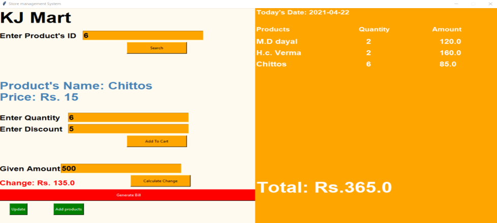
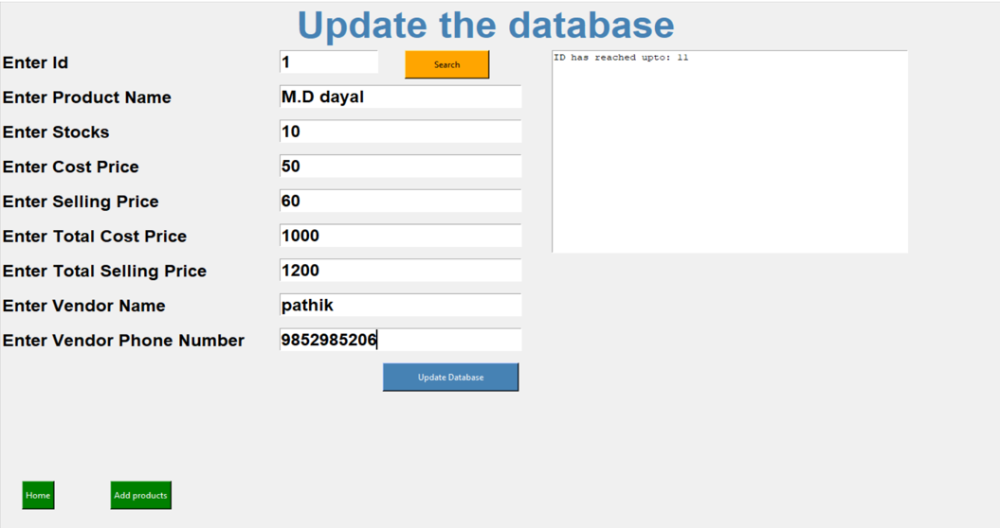
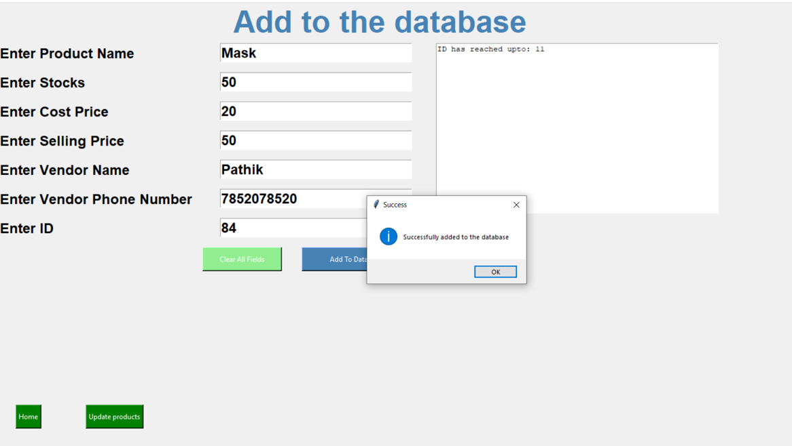

<h1 align="center">KJ Mart</h1>

---
<div align="center">
  <br>
  <h2>Store-management-system</h2>
  <h3>Python application for a store to manage the bills and handle the sales of there products</h3>
</div>

---

## Functionalities
1. Add as many products to database
2. Update info about products as per your choice 
3. Handle dynamic sales
4. Generate & save bills
5. Print bills
6. Notifies less stock in database 
---

## Snapshots of the project :

Landing Page


Update the products
 

Add a new product the database
  

---
### Installation

- Install dependencies

```sh
        $ pip3 install -r requirements.txt
```
---
<h4 align="center"><b>Developed with :heart: by 
<a href="https://github.com/rushabhgandhi13">Rushabh Gandhi</a> and <a href="https://github.com/Patrickbro13">Pathik Ghugare</a></b> , 
</h4>

---
